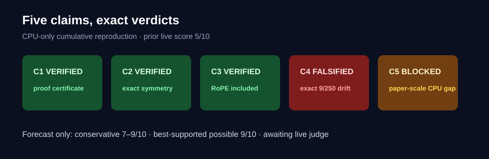
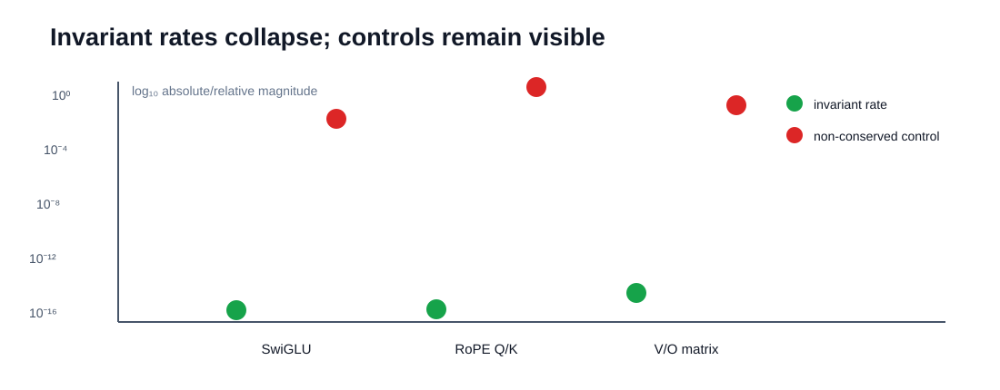
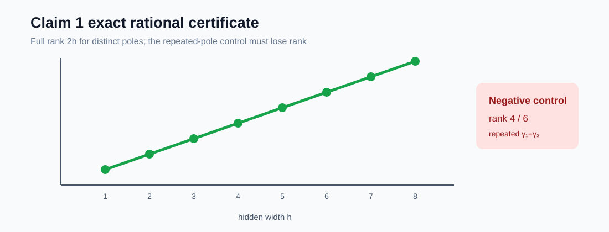
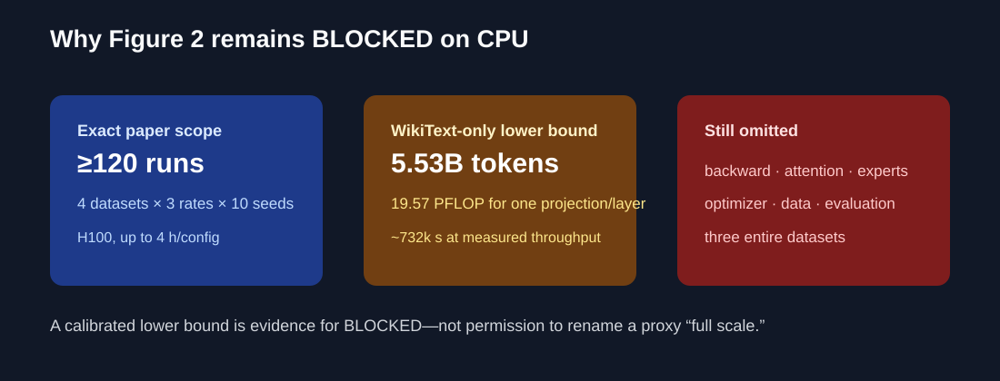

# Conservation Laws for Modern Neural Architectures: a claim-by-claim CPU reproduction



The paper asks which quantities remain fixed during continuous-time neural
network training, and whether those predictions remain visible under discrete
optimization. This reproduction replaces a 5/10 toy-only baseline with exact
symbolic certificates, model-width numerical audits, an assumption-satisfying
counterexample, and one deliberately BLOCKED paper-scale claim. The
conservative post-release forecast is **7–9/10**; **9/10 is the
best-supported possible score**, not a judge result.

## What was implemented

One fixed command runs every claim and all earlier regressions:

```bash
uv run --frozen --no-dev python -m conservation_repro.run
```

The environment is Python 3.12 with NumPy 2.3.2, locked by `uv.lock`. The code
path is deliberately small: `run.py` calls one verifier per claim; each
verifier emits machine-readable results and fails closed. Formal uncertain or
multi-core work ran on Hugging Face `cpu-upgrade`; only short syntax and
manifest checks ran locally.

## Strongest observed evidence



The SwiGLU, RoPE Q/K, and attention V/O rates collapse to floating-point
roundoff, while controls chosen not to be conserved remain many orders of
magnitude larger. These are supporting audits. The strongest evidence is
structural: inverse parameter transformations leave the network function
exactly unchanged, so differentiating the symmetry yields the invariant under
Euclidean gradient flow.

| Claim | Paper statement | Observed evidence | Verdict |
| --- | --- | --- | --- |
| C1 | GELU/SiLU have only constant C1 laws | Arbitrary-width Taylor/pole derivation; exact ranks 2–16 | VERIFIED |
| C2 | SwiGLU gradient characterization and norm differences | Exact iff reconstruction; max relative rate `3.91e-16` | VERIFIED |
| C3 | MHA and RoPE invariants | Exact group actions; RoPE rate `6.66e-16` | VERIFIED |
| C4 | Dense, sparse, and sigmoid MoE laws | Dense/sparse symmetry certificates; sigmoid derivative `9/250` | FALSIFIED |
| C5 | Figure 2 scaling on four named datasets | Four routes completed; exact campaign unavailable on CPU | BLOCKED |

## Claim 1: proof replaces candidate testing



The historical baseline only showed that one ReLU-style expression drifted.
That cannot establish “all laws are constant.” The new verifier reconstructs
the completeness argument. Orthogonality at inputs `x=t e_j` produces an
arbitrary-width family whose even Taylor coefficients yield

`sum_i (u_i + m w_i) gamma_i^m = 0`.

Its generating function has distinct simple and double poles. Pole order
forces every `w_i` and then every `u_i` to vanish. C1 continuity extends the
zero gradient from a dense set to the full connected parameter space. Exact
Fraction arithmetic checks the numerator map through width eight; deliberately
repeating a pole drops rank from 6 to 4.

## Claims 2–3: modern blocks retain exact symmetries

For SwiGLU, scaling `A[:,i]` by `exp(t)` and `C[i,:]` by `exp(-t)` cancels
inside every model term. A separate arbitrary-width SiLU linear-independence
argument establishes the theorem's iff gradient characterization. The
paper-width audit used `d=256`, intermediate width 1024, 12 repeated layer
instances, and ten seeds.

For attention, `Q→QE, K→KE^{-T}` and `V→VF, O→OF^{-T}` preserve the network
function. RoPE is not skipped: each fixed rotation sits between matched Q/K
blocks whose exponents `+1` and `−1` cancel for every position pair. The
formal audit used 12 layers, `d=192`, three 64-dimensional heads, ten seeds,
and an intended non-conserved control of at least `0.3807`.

## Claim 4: a valid counterexample earns the verdict

Theorem 4.7 says normalized-sigmoid MoE laws coincide with softmax MoE laws.
At `d=3` with two exact SwiGLU experts, input `e1`, target zero, logits
`(0,ln 3)`, and squared loss, exact arithmetic gives

`d/dt (W_1,1 + W_2,1) = 9/250`.

The matched softmax derivative is exactly zero. An independent 80-digit
central difference matches `-9/250` to `2.28e-53`. Dense and sparse softmax
variants are addressed separately by common-shift and Top-k-preservation
certificates; shifting only one selected gate changes the output as intended.

## Claim 5: the honest stopping point



Three materially different verification routes left confidence LOW, so the
mandatory fourth route sought falsification. The one-step quadratic slope-two
check was shown to be algebraic and therefore circular as architecture
evidence; a non-conserved control has slope one. The paper configuration audit
found at least 120 individual runs and no released training code or raw
trajectories. A CPU benchmark then formed a deliberately weak WikiText-only
lower bound.

The fourth route used the exact normalized-sigmoid counterexample and observed
first-order drift, but it is not one of the paper's named dataset trajectories.
It cannot falsify the historical empirical observation. Claim 5 is therefore
BLOCKED. Unblocking requires the authors' executable training code and raw
trajectories, or the exact accelerator campaign—neither is compatible with
the authorized CPU-only compute.

## Assessment and provenance

Previous live judged score: **5/10**. Claims 1–4 materially changed: C1 now
has proof-level evidence, C2 adds a completeness reconstruction, C3 includes
RoPE, and C4 addresses dense/sparse softmax while falsifying normalized
sigmoid. C5 remains below full credit, now with a rigorous BLOCKED record.

The winning lineage is:

`historical baseline → Claim 4 counterexample → Claim 2 → Claim 3 → Claim 1 → Claim 5 → release candidate`.

Every formal experiment inherits the exact command shown above. Branch links
and immutable run provenance are summarized in the repository README. The
published evaluator artifact preserves every file from judged Hugging Face
revision `47668d9139058ae1e50a39d5bfcb7280fdd74c34` and labels its old pages
**Historical rejected baseline**.
